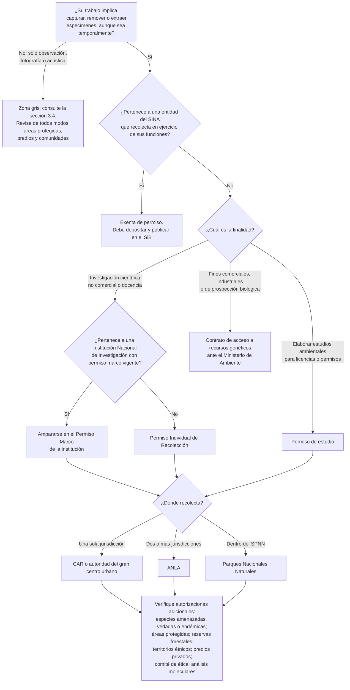

# 8. Herramientas

_Borrador v0.1 — 10 oct. 2026. Extensión objetivo: 2,5 páginas._

## 8.1 Flujograma: ¿qué permiso necesito?

**Figura 8.1.** Árbol de decisión para identificar el permiso de recolección y las autorizaciones adicionales. [Borrador en Mermaid; se diagramará para la versión final.]

## 8.2 Tabla resumen

**Tabla 8.1.** Resumen de permisos y autorizaciones. [Se consolidará con la Tabla 3.1 en la versión final para evitar duplicación.]

| Situación | Instrumento | Autoridad | Norma principal | Sección |
|---|---|---|---|---|
| Investigación no comercial o docencia de una institución | Permiso Marco de Recolección (hasta 10 años) | CAR / gran centro urbano; ANLA; PNN | DUR, arts. 2.2.2.8.2.1 y ss. | 3.1 |
| Proyecto de investigación no comercial de una persona o entidad sin permiso marco | Permiso Individual (hasta 5 años) | Igual | DUR, arts. 2.2.2.8.3.1 y ss. | 3.2 |
| Estudios ambientales para licencias o permisos | Permiso de estudio (hasta 2 años) | Igual | DUR, arts. 2.2.2.9.2.1 y ss. | 3.3 |
| Especies amenazadas, vedadas o endémicas (bajo permiso marco) | Autorización previa | Autoridad que otorgó el permiso | DUR, art. 2.2.2.8.2.4, par. 1 | 3.6 |
| Recolección en el SPNN (bajo permiso marco) | Autorización previa (30 días) | PNN | DUR, art. 2.2.2.8.2.4, par. 2 | 3.6 |
| Infraestructura de investigación en reserva forestal de Ley 2 | Aviso previo (sin sustracción) | MADS (nacional) / autoridad regional | Res. 0083/2026, arts. 2 y 6 | 3.6 |
| Acceso a recursos genéticos con fines comerciales o de bioprospección | Contrato de acceso | MADS | Decisión 391/1996; Res. 1348/2014 | 3.5 |
| Movilización de especímenes sin permiso de recolección | SUNL | Autoridad ambiental competente | Res. 1909/2017 | 5.1 |
| Exportación de especies CITES | Permiso o certificado CITES | MADS | Ley 17/1981; Decreto 1401/1997 | 5.5 |
| Depósito de especímenes | Constancia de depósito | Colección registrada | DUR, arts. 2.2.2.8.3.3 y 2.2.2.9.1.8 | 5.2 |
| Publicación de datos | Constancia del SiB | SiB Colombia | DUR, art. 2.2.2.8.2.4, lit. e, y concordantes | 5.3 |

## 8.3 Listas de chequeo

**Antes del campo**

- [ ] Definí la finalidad de la recolección (investigación, estudio ambiental, comercial).
- [ ] Identifiqué el permiso aplicable y la autoridad competente según la jurisdicción.
- [ ] El permiso está vigente durante todo el periodo de muestreo.
- [ ] Revisé si hay especies amenazadas, vedadas o endémicas entre los objetivos y pedí la autorización previa.
- [ ] Revisé si el área es protegida, reserva forestal o territorio étnico, y obtuve las autorizaciones correspondientes.
- [ ] Tengo autorización escrita de los propietarios de los predios.
- [ ] Tengo el aval del comité de ética institucional.
- [ ] Identifiqué la colección registrada que recibirá los especímenes.
- [ ] Si haré análisis moleculares, verifiqué que no configuran acceso o tramité el contrato.

**Durante el campo**

- [ ] Llevo copia del permiso y de las autorizaciones.
- [ ] Recolecto solo las especies, cantidades, sitios y métodos autorizados.
- [ ] Diligencio formularios de campo y registro coordenadas, fecha, colector y esfuerzo de muestreo.
- [ ] Respeto los acuerdos con comunidades y propietarios.

**Después del campo**

- [ ] Deposité los especímenes y recibí la constancia.
- [ ] Publiqué los datos en el SiB Colombia y recibí la constancia.
- [ ] Envié el informe a la autoridad con ambas constancias.
- [ ] Remití al Ministerio las publicaciones derivadas de análisis moleculares.
- [ ] Devolví los resultados a la comunidad.
- [ ] Planifiqué la renovación del permiso si el monitoreo continúa.
